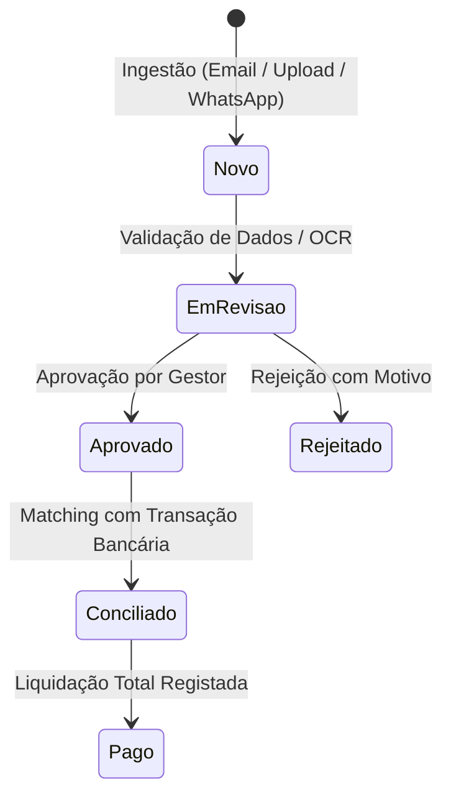

# Análise Comparativa & Relatório de Melhorias UX/UI
## Benchmark: App de Gestão de Faturas Portuguesa (Dori Finance) vs. DocFlow

> **Documento de Análise e Recomendações Estratégicas**  
> **Data:** 1 de Setembro de 2026  
> **Foco:** Layout visual, organização de fluxos financeiros em Portugal, experiência de utilizador (UX/UI) e melhorias acionáveis para o DocFlow.

---

## 1. Sumário Executivo

A leitura e extração de dados fiscais no **DocFlow** já atingiu elevada precisão com o motor de OCR e suporte ao QR Code da Autoridade Tributária (**QR-AT**). Contudo, a experiência operacional diária de gestores, fundadores e contabilistas portugueses depende criticamente de **como** a informação é organizada, verificada, aprovada e reconciliada.

A análise visual e funcional detalhada da aplicação de referência portuguesa (**Dori Finance** — `app.dorifinance.com` / `dorifinance.com`) e das suas interfaces mobile/web revela um produto desenhado especificamente para o tecido empresarial nacional:
1. **Simplicidade Radical e Clareza Visual:** Estética *light-first*, espaçamentos generosos, cartões brancos com sombras suaves (`box-shadow`), tipografia moderna (*Figtree* + *Inter*) e destaques em verde esmeralda (`#10b981` / `#059669`).
2. **Separação Clara de Fluxos Contabilísticos:** Distinção explícita entre **Despesas / Faturas a Pagar** (com planeador de tesouraria e alertas vermelhos de faturas em atraso) e **Vendas / Faturas a Receber**, complementadas por reconciliação bancária automática com os principais bancos portugueses (CGD, Millennium BCP, Santander, Novo Banco, Montepio, Crédito Agrícola, Bankinter, BBVA, etc.).
3. **Ingestão Sem Fricção:** Três canais de entrada imediatos — Email de reencaminhamento dedicado (`empresa@dorimail.com`), Envio por WhatsApp (foto de talão/recibo) e Upload em massa (arrastar até 40 ficheiros).
4. **Relatórios e P&L Adaptados ao SNC:** Demonstração de Resultados (DRE) estruturada conforme as normas contabilísticas portuguesas (Margem Bruta, Gastos Operacionais com Salários/Segurança Social/Rendas/Subscrições, IRC e Fluxo de Caixa).

Este relatório disseca os padrões visuais e arquiteturais da aplicação de referência e estabelece um **plano de melhorias prioritárias e ranqueadas** para o DocFlow.

---

## 2. Anatomia da Aplicação de Referência (Dori Finance)

### 2.1 Estrutura de Ecrãs e Arquitetura de Navegação

A navegação está dividida numa barra lateral / menu expansível limpo com ícones semânticos:

| Secção | Ecrãs / Sub-vistas | Funcionalidade Principal |
| :--- | :--- | :--- |
| **Vista Geral** | *Dashboard Executivo* | Cards de KPI de topo: **Saldo Total**, **Receita**, **Despesas**, **IVA Estimado a Pagar** (destaque a verde) e **Vendas em Aberto**. Seletor global de intervalo de datas (`3 jul 2026 – 1 set 2026`). |
| **Vendas** | • *Faturas de venda*<br>• *Faturas a receber* (Planeador) | Gestão de receitas de clientes, faturas em aberto e previsão de cobranças com contadores de faturas em atraso. |
| **Despesas** | • *Faturas de despesa*<br>• *Faturas a pagar* (Planeador) | Monitorização de gastos de fornecedores, categorização automática e cartões de alerta: **Total em atraso** (fundo rosa suave + texto vermelho `#ef4444` + ícone de perigo) e **Total a pagar** (ícone de relógio). |
| **Transações** | *Transações Bancárias* | Tabela consolidada de movimentos sincronizados via Open Banking / GoCardless, com estado de reconciliação com faturas. |
| **Bancos** | *Ligar conta bancária* | Conexão bancária via GoCardless cobrindo CGD, BCP, Santander, Novo Banco, Montepio, Crédito Agrícola, Bankinter, BBVA, Abanca, Monese, Wise, Swan, etc., destacando permissões *read-only* e conformidade PSD2. |
| **Relatórios** | *Painel de Análise Financeira* | **Demonstração de Resultados (P&L)** e **Fluxo de Caixa**, discriminando rubricas: Receitas de vendas, Subsídios, Custo das Vendas (Inventários, Cloud, Comissões), Gastos Operacionais (Marketing, Viagens/Refeições, Salários, Freelancers, TSU/Segurança Social, Software, Rendas, Seguros, Juros) e IRC. |
| **Definições** | • *Empresa*<br>• *Utilizador*<br>• *Integrações*<br>• *Faturação* | Configuração de NIF, morada e dimensão; Integrações nativas (ex: **InvoiceXpress** para sincronizar faturas de venda automaticamente e **WhatsApp** para despesas); Gestão de subscrição Stripe. |

---

### 2.2 Layout de Detalhe da Fatura e Campos

```
┌────────────────────────────────────────────────────────────────────────┐
│  ← Voltar às Despesas    FT 2026/894 · Staples Portugal    [ Aprovado ]│
├──────────────────────────────────┬─────────────────────────────────────┤
│  PRÉ-VISUALIZAÇÃO DO DOCUMENTO   │  CAMPOS FISCAIS & CONTABILIDADE     │
│  ┌────────────────────────────┐  │  ┌─ Autenticação AT & QR ─────────┐ │
│  │ [Rotacionar] [Zoom] [Baixar]│ │  │ [✓ QR-AT Válido] ATCUD: J3829..│ │
│  │                            │  │  └────────────────────────────────┘ │
│  │                            │  │  ┌─ Identidade do Documento ──────┐ │
│  │    [ Imagem da Fatura /    │  │  │ Fornecedor: Staples Portugal ↗ │ │
│  │      Visualizador PDF ]    │  │  │ NIF: 502938472  Nº: FT 2026/894│ │
│  │                            │  │  └────────────────────────────────┘ │
│  │                            │  │  ┌─ Linhas de Itens (Produtos) ───┐ │
│  │                            │  │  │ Papel A4 (x5) ....... 22.50 €  │ │
│  │                            │  │  │ Toners Laser (x2) ... 89.00 €  │ │
│  │                            │  │  └────────────────────────────────┘ │
│  │                            │  │  ┌─ Montantes e IVA ──────────────┐ │
│  │                            │  │  │ Base: 111.50€ | IVA: 25.65€    │ │
│  │                            │  │  │ Total: 137.15 €                │ │
│  │                            │  │  └────────────────────────────────┘ │
│  │                            │  │  [ Rejeitar ]    [ APROVAR FATURA ]│
│  └────────────────────────────┘  │  └──────────────────────────────────┘ │
└──────────────────────────────────┴─────────────────────────────────────┘
```

#### Destaques do Layout de Detalhe:
1. **Cabeçalho com Contexto:** Título sempre formatado como `{Número de Fatura} · {Nome do Fornecedor}` acompanhado pelo badge de estado colorido.
2. **Visualização Lado a Lado (Split View):**
   - Lado esquerdo: Ficheiro original fixo (*sticky*) com controlos de manipulação (zoom, rotação 90° e download).
   - Lado direito: Painel modular em acordeão ou cartões agrupados por contexto lógico.
3. **Linhas de Artigos / Itens:** Tabela dedicada para produtos/serviços detalhando descrição, quantidade, preço unitário, taxa de IVA e valor total, com linha de validação matemática de somatório.
4. **Link Rápido para a Ficha de Fornecedor:** O nome do fornecedor inclui um link direto ou gatilho para gaveta (*drawer*) com o histórico de compras, NIF, morada e validação de IBAN.

---

### 2.3 Fluxo de Aprovação e Estados

A aplicação de referência organiza os documentos num fluxo claro e auditável:



- **Estados Visuais Diferenciados:**
  - `NOVO`: Azul suave / Sky (`badge-sky`)
  - `EM REVISÃO`: Âmbar / Laranja de atenção (`badge-amber`)
  - `APROVADO`: Verde esmeralda (`badge-emerald`)
  - `REJEITADO`: Vermelho rosado (`badge-rose`)
  - `CONCILIADO`: Violeta / Roxo (`badge-violet`)
  - `PAGO`: Cinzento neutro / Slate (`badge-neutral`)
- **Ações de Transição:** Botão primário proeminente verde **"Aprovar Fatura"** (com confirmação) e botão secundário vermelho discreto **"Rejeitar"**.
- **Travamento de Edição:** Após aprovação, os campos ficam bloqueados em modo só-leitura para impedir inconsistências contabilísticas.

---

### 2.4 Ficha de Fornecedor / Entidade (*Supplier Sheet*)

A gestão de entidades na aplicação de referência agrega inteligência financeira centralizada:
- **Dados Mestres:** Razão Social, Nome Comercial, NIF português (com validação de dígito de controlo), Morada completa, Contactos (Email e Telefone).
- **Segurança e Anti-Fraude de IBAN:**
  - Registo do IBAN principal e BIC/SWIFT.
  - Histórico de alterações de IBAN com auditoria (quem alterou, data e motivo).
  - Classificação de risco de fatura contra o histórico (alerta de alteração súbita de IBAN de fornecedor recorrente).
- **Pré-configuração Contabilística (SNC):**
  - Conta de débito predefinida (ex: `62211 - Material de escritório`).
  - Conta de crédito predefinida (ex: `22111 - Fornecedores c/c`).

---

### 2.5 Manipulação de Imagem, Orientação e Zoom

Em Portugal, uma percentagem muito elevada de despesas operacionais (restauração, combustível, pequenas compras) chega via fotografias tiradas pelo telemóvel na vertical ou invertidas.
- **Deteção e Correção de Orientação:** Suporte a rotação manual em incrementos de 90° (horário / anti-horário) e correção automática através dos metadados EXIF da câmara.
- **Zoom & Pan Intuitivo:** Botões `+` / `-` / `1:1` / `Ajustar à largura` e suporte a duplo clique ou scroll para ampliar zonas críticas (tabela de taxas de IVA ou QR Code).

---

### 2.6 Nomenclatura Padronizada de Documentos

Em vez de manter nomes de ficheiros gerados automaticamente por scanners ou câmaras (`IMG_20260901_143955.jpg` ou hashes `d8e3b1...`), a aplicação de referência normaliza e exibe:
- **Nome de Apresentação:** `FT 2026/894 · Staples Portugal`
- **Nome de Ficheiro Exportável:** `PT502938472_FT_2026-894_2026-08-30.pdf`
- **Taxonomia Padronizada:** `[NIF]_[TipoDoc]_[NumeroDoc]_[DataDoc].[ext]`

---

### 2.7 Padrões Visuais e UX de Destaque

| Elemento de Design | Padrão da Aplicação de Referência | Efeito na Experiência de Utilizador |
| :--- | :--- | :--- |
| **Paleta de Cores** | Branco puro (`#ffffff`), cinzentos neutros claros (`#f9fafb`, `#f3f4f6`), verde esmeralda primário (`#10b981`), alertas rosa-vermelho suave (`#fef2f2` / `#ef4444`). | Transmite autoridade, confiança bancária e reduz o cansaço visual. |
| **Cards de Métricas** | Retângulos com bordas arredondadas (8–12px), ícone semântico à direita, valor em corpo 24–32px semibold. | Leitura instantânea do estado da empresa em menos de 3 segundos. |
| **Tipografia** | Família moderna (*Figtree* ou *Inter*), pesos 500/600 para rótulos, `tabular-nums` para moedas e `font-mono` para NIFs/IBANs. | Elimina desalinhamentos em tabelas numéricas e facilita a conferência fiscal. |
| **Feedback de Ingestão** | Modais claros com drag & drop tracejado a verde e indicação explícita dos formatos (`.pdf`, `.png`, `.jpg` até 40 ficheiros). | Reduz as dúvidas do utilizador sobre capacidade de processamento. |

---

## 3. Comparativo Detalhado: Referência vs. DocFlow Atual

| Dimensão Funcional / Visual | Aplicação de Referência (Dori Finance) | DocFlow Atual (`docflow-mvp`) | Avaliação / Oportunidade |
| :--- | :--- | :--- | :--- |
| **1. Extração QR-AT vs OCR** | QR Code lido prioritariamente com validação fiscal direta dos 4 patamares de IVA e NIFs. | Possui `QrBadge` e extração de QR, mas a interface não distingue claramente os campos preenchidos a 100% pelo QR dos campos estimados por OCR. | **Grande Oportunidade:** Destacar visualmente quais os campos autenticados pela AT com selo de verificação verde. |
| **2. Fluxo de Aprovação** | Pipeline visual (`Novo` → `Revisão` → `Aprovado` → `Conciliado` → `Pago`) e planeador de contas a pagar com alertas de atraso. | Botões "Re-extrair", "Aprovar" e "Guardar" no topo do `FieldPanel`; status em badge; integração TOConline em stub. | **Oportunidade:** Criar uma barra de progresso visual do documento e incorporar vistas de "Faturas a Pagar / Vencimento". |
| **3. Linhas de Produtos (Linhas de Fatura)** | Tabela limpa com descrição, Qtd, Preço Un., IVA e Total, com validação de soma total. | Já possui tabela de linhas e indicador `Δ Total−Linhas` no `field-panel.tsx`, mas falta edição/adição manual de linhas quando o OCR falha. | **Oportunidade:** Permitir edição rápida inline nas linhas e cálculo dinâmico de taxas de IVA. |
| **4. Ligação à Ficha de Fornecedor** | Link direto e visualização integrada de dados fiscais do fornecedor. | O DocFlow possui o módulo `/parties` com `PartyIbanPanel` e score de risco, mas não há atalho direto na página do documento `[id]`. | **Oportunidade Imediata:** Adicionar link / botão "Ver Ficha" ou gaveta (*drawer*) com atalho para a entidade associada. |
| **5. Rotação e Zoom de Imagem** | Ferramenta com rotação 90° e zoom interativo. | `DocumentViewer` suporta PDF (`<iframe>`) e Imagem (``), mas não possui controlos de rotação, zoom ou pan. | **Oportunidade Crítica:** Implementar rotação (90°/180°/270°) e zoom com cursor no `DocumentViewer`. |
| **6. Nomenclatura de Documentos** | Normalização semântica automática no título e exportação. | Usa `doc.docNumber ?? doc.fileName ?? Documento ID`. Ficheiros carregados mantêm nomes aleatórios. | **Oportunidade:** Padronizar o título e adicionar botão de copiar nome fiscal normalizado. |
| **7. Estética Visual Geral** | *Light-first*, minimalista, verde financeiro, tipografia *Figtree*, sombras suaves. | *Dark-mode/slate* com tons violeta/índigo, estritamente técnico. | **Oportunidade:** Refinar contraste, espaçamentos e introduzir tema claro moderno de alta legibilidade. |

---

## 4. Plano de Ação Ranqueado e Recomendações de Melhoria

Abaixo encontra-se a lista ranqueada de melhorias visuais e funcionais mapeadas exatamente aos 6 pedidos do utilizador:

### Rank 1: QR Read First (Prioridade Máxima de Extração)
* **Objetivo:** O QR-AT em Portugal contém dados fiscais 100% determinísticos (NIF emitente, NIF adquirente, tipo de documento, data, número de documento, bases e valores de IVA para cada taxa e ATCUD). O utilizador deve ver de imediato que os dados vieram do QR e não de uma estimativa de OCR.
* **Melhorias UI/UX:**
  1. **Selo de Verificação Fiscal:** Adicionar um badge de destaque no topo da coluna de campos: `[ ✓ Autenticado via QR-AT da Autoridade Tributária ]`.
  2. **Indicador de Campo Verificado:** Substituir a percentagem de confiança OCR (ex: `98%`) por um ícone de verificação verde sólido (`QR ✓`) nos campos que foram extraídos diretamente do payload do QR-AT.
  3. **Desdobramento de IVA Automático:** Apresentar a discriminação das taxas de IVA (Isento, 6%, 13%, 23%) pré-preenchidas a partir das chaves `I1` a `I8` do QR.

---

### Rank 2: Fluxo de Aprovação & Planeador Financeiro
* **Objetivo:** Transformar a página de detalhe e as listagens num fluxo operacional fluido para a equipa financeira.
* **Melhorias UI/UX:**
  1. **Barra de Etapas do Documento (*Stepper*):**
     Inserir no topo do detalhe uma barra horizontal interativa:
     `[ 1. Ingestão & QR ] → [ 2. Validação de Dados ] → [ 3. Aprovado ] → [ 4. Conciliado c/ Banco ]`
  2. **Ações Primárias Claras:**
     - Botão verde destacado: **"Aprovar Fatura"** (atalho de teclado: `Ctrl + Enter`).
     - Botão secundário: **"Rejeitar / Devolver"** (abre diálogo para especificar o motivo: duplicado, valor errado, dados ilegíveis).
  3. **Cartões de Alerta de Tesouraria na Listagem:**
     Adicionar cartões de resumo inspirados no Dori Finance no topo de `/documents`:
     - *Total a Pagar Este Mês* (com badge de dias até ao vencimento).
     - *Faturas em Atraso* (com fundo rosa/vermelho de alta visibilidade).

---

### Rank 3: Apresentação e Edição de Linhas de Artigos (*Product Line Display*)
* **Objetivo:** Permitir a conferência detalhada e correção imediata dos itens adquiridos.
* **Melhorias UI/UX:**
  1. **Tabela de Artigos com Linhas Editáveis:**
     Permitir clicar numa célula (Descrição, Qtd, Preço Unitário, Taxa de IVA) para edição rápida caso o OCR tenha falhado num caractere.
  2. **Botão de Adicionar Linha Manual:**
     Adicionar botão `+ Adicionar Linha` para faturas onde o scanner apenas apanhou o total mas o contabilista necessita da discriminação de centros de custo.
  3. **Caixa de Validação de Somatório (*Reconciliation Callout*):**
     Manter o badge `Δ Total − Linhas` em verde quando a diferença for `0.00 €` e em alerta âmbar com botão de ajuste automático quando houver pequenas divergências de arredondamento de cêntimos.

---

### Rank 4: Ligação à Ficha de Fornecedor (*Supplier Sheet Link*)
* **Objetivo:** Estabelecer a ponte imediata entre a fatura em revisão e a entidade no módulo `/parties`.
* **Melhorias UI/UX:**
  1. **Link de Navegação e Ícone de Atalho:**
     No campo "Fornecedor" do `FieldPanel`, adicionar um botão com ícone de link externo (`ExternalLink`): `Ver Ficha do Fornecedor ↗`.
  2. **Gaveta Lateral de Consulta Rápida (*Quick Slide-over Drawer*):**
     Ao clicar no fornecedor, em vez de abandonar a fatura, abrir uma gaveta lateral que mostra:
     - NIF e dados de contacto.
     - Histórico de IBAN e indicador de risco de fraude (`PartyIbanPanel`).
     - Contas de Débito/Crédito predefinidas do SNC (com botão para aplicar à fatura atual com 1 clique).
     - Últimas 5 faturas processadas deste fornecedor.

---

### Rank 5: Ferramentas de Orientação de Imagem, Rotação e Zoom
* **Objetivo:** Permitir ao utilizador ler facilmente talões de combustíveis, recibos de restauração ou faturas digitalizadas na vertical/invertidas.
* **Melhorias UI/UX:**
  1. **Barra de Ferramentas no `DocumentViewer`:**
     - Botão `Girar 90° à Esquerda` (`RotateCcw`).
     - Botão `Girar 90° à Direita` (`RotateCw`).
     - Botão `Zoom In (+)` e `Zoom Out (-)`.
     - Botão `Ajustar à Janela` (`Maximize2` / `Scan`).
  2. **Persistência de Rotação:**
     Guardar a rotação corrigida pelo utilizador no backend para que outros membros da equipa vejam o documento na orientação correta.
  3. **Suporte a Pan / Arrastar:**
     Permitir arrastar a imagem ampliada com o rato para inspecionar carimbos, assinaturas ou números de série.

---

### Rank 6: Nomenclatura Semântica de Documentos (*Document Naming*)
* **Objetivo:** Acabar com nomes de ficheiro enigmáticos e fornecer rastreabilidade imediata.
* **Melhorias UI/UX:**
  1. **Geração Automática do Nome Canónico:**
     Formatar dinamicamente o título do documento como:  
     `{TipoDoc} {NumeroDoc} · {NomeFornecedor}` (ex: `FT 2026/1042 · Staples Portugal`).
  2. **Nome de Ficheiro Normalizado no Download:**
     Ao clicar no botão de download, exportar o ficheiro com o formato normalizado:  
     `[NIF]_[TipoDoc]_[NumeroDoc]_[DataDoc].pdf` (ex: `502938472_FT_2026-1042_2026-08-31.pdf`).
  3. **Botão de Cópia Rápida:**
     Ícone de cópia ao lado do nome do documento para colar facilmente em emails, lançamentos bancários ou softwares externos.

---

## 5. Matriz de Prioridade e Esforço de Implementação

| Melhoria | Impacto no Utilizador | Esforço Técnico | Ficheiros Alvo no DocFlow |
| :--- | :---: | :---: | :--- |
| **1. Controlo de Rotação e Zoom** | 🔥 Elevado | 🟢 Baixo | `apps/web/app/(dashboard)/documents/[id]/_components/document-viewer.tsx` |
| **2. Link / Drawer para Ficha de Fornecedor** | 🔥 Elevado | 🟢 Baixo | `apps/web/app/(dashboard)/documents/[id]/_components/field-panel.tsx`, `page.tsx` |
| **3. Destaque Visual de Extração QR-AT** | 🔥 Elevado | 🟢 Baixo | `apps/web/app/(dashboard)/documents/[id]/_components/qr-badge.tsx`, `field-panel.tsx` |
| **4. Nomenclatura Padronizada de Documentos** | ⚡ Médio | 🟢 Baixo | `apps/web/app/(dashboard)/documents/[id]/page.tsx`, `document-viewer.tsx` |
| **5. Linhas de Produtos Editáveis** | ⚡ Médio | 🟡 Médio | `apps/web/app/(dashboard)/documents/[id]/_components/field-panel.tsx` |
| **6. Stepper de Aprovação e Planeador de Vencimentos** | 🔥 Elevado | 🟡 Médio | `apps/web/app/(dashboard)/documents/[id]/page.tsx`, `/documents/page.tsx` |

---

## 6. Conclusão

A combinação da robustez do motor de extração existente no DocFlow com o refinamento visual e a fluidez de fluxos da aplicação de referência (**Dori Finance**) posicionará o DocFlow como uma solução de topo no mercado português de gestão documental e financeira. 

A implementação imediata das melhorias visuais de visualização (rotação/zoom), ligação entre documentos e entidades, e distinção inequívoca dos dados fiscais do QR-AT elevará exponencialmente a confiança e a velocidade operacional dos utilizadores.
