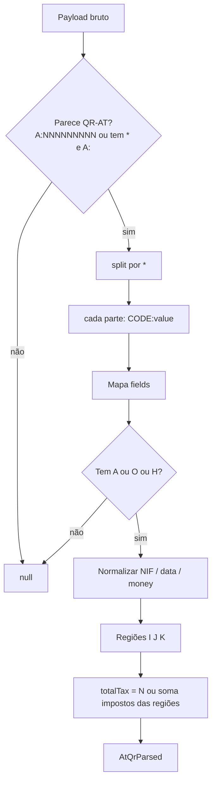
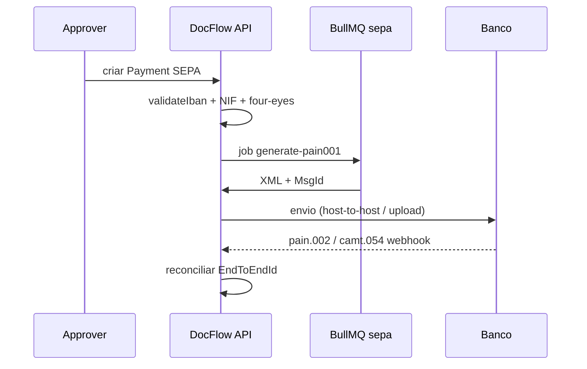

# DocFlow — Integrações e regras fiscais portuguesas

Especificação de implementação para o núcleo fiscal PT: QR Code AT / ATCUD, IVA (CIVA), SAF-T (PT), SEPA `pain.001` e callbacks TOConline / Ifthenpay / Moloni / WooCommerce.

Código executável: `packages/shared/src/portuguese/` (`qr-at.util.ts`, `iva.util.ts`, `nif.util.ts`, `iban.util.ts`).

Fontes de referência no código legado:

- `C:\Projetos\grok-documental\apps\api\src\extraction\at-qr.parser.ts` (parser QR-AT real)
- `C:\Projetos\grok-documental\apps\api\src\integrations\` (TOConline OAuth2 + Ifthenpay callback)
- `C:\Projetos\deep-seek-documental\apps\api\src\ocr\qrcode-at.service.ts` (mapeamento FT/FS/FR/NC/ND)
- `C:\Projetos\gemini-documental\packages\shared` — esqueleto vazio, não portar

Base legal (resumo): DL n.º 28/2019, Portaria n.º 195/2020 (QR + ATCUD), CIVA, Portaria n.º 302/2016 e atualizações SAF-T (PT) 1.04_01, ISO 20022 `pain.001`, ISO 13616 / ISO 7064 (IBAN).

---

## 1. Algoritmo QR Code AT / ATCUD

### 1.1 Payload

O QR da Autoridade Tributária é um payload ASCII de campos `CODIGO:valor` separados por `*`. Exemplo:

```
A:500697370*B:500000000*C:PT*D:FT*E:N*F:20260315*G:FT 2026/123*H:J66S9FDD-123*I1:PT*I7:100.00*I8:23.00*N:23.00*O:123.00*Q:ABCD*R:9999
```

| Código | Campo | Obrigatório | Notas |
|---|---|---|---|
| A | NIF emitente | sim | 9 dígitos, validar módulo 11 |
| B | NIF adquirente | sim | `0` / `999999990` = consumidor final; omitir no modelo interno |
| C | País do adquirente | se B preenchido | ISO 3166-1 alpha-2; default `PT` |
| D | Tipo de documento | sim | ver tabela 1.3 |
| E | Estado | sim | `N` normal, `A` anulado, `F` faturado, `S` autoconsumo |
| F | Data | sim | `YYYYMMDD` |
| G | Identificador único | sim | série + número, ex. `FT 2026/123` |
| H | ATCUD | sim (DL 28/2019) | `{codigoValidacaoSerie}-{sequencial}` |
| I1–I8 | IVA Continente | se houver IVA PT | região `PT` |
| J1–J8 | IVA Açores | se houver | região `PT-AC` |
| K1–K8 | IVA Madeira | se houver | região `PT-MA` |
| L | Não sujeito / não tributável | não | outras operações |
| M | Imposto do selo | não | |
| N | Total de impostos | sim se houver IVA | soma I4+I6+I8 + J* + K* + M |
| O | Total do documento | sim | bruto a pagar |
| P | Retenção na fonte | não | IRS/IRC/IVA caixa |
| Q | Hash | sim (software certificado) | **4 primeiros** caracteres do hash AT |
| R | Nº certificado software | sim | número AT do programa certificado |

Breakdown IVA por prefixo `I` / `J` / `K`:

| Sufixo | Significado |
|---|---|
| 1 | Código da região (`PT`, `PT-AC`, `PT-MA`) |
| 2 | Base isenta |
| 3 | Base taxa reduzida |
| 4 | Imposto taxa reduzida |
| 5 | Base taxa intermédia |
| 6 | Imposto taxa intermédia |
| 7 | Base taxa normal |
| 8 | Imposto taxa normal |

### 1.2 Algoritmo de parse (espelha `parseAtQr`)



Regras de normalização:

1. `trim` + preservar `raw`.
2. Códigos de campo em maiúsculas.
3. Montantes: `replace(',', '.')` → `parseFloat`; rejeitar `NaN`.
4. Data `F`: só aceitar `\d{8}` → `YYYY-MM-DD`.
5. `B === '0'` → `buyerNif` undefined (consumidor final).
6. `totalTax`: campo `N`; fallback = soma `taxReduced + taxIntermediate + taxNormal` das regiões.

### 1.3 Tipos de documento (campo D)

| Código AT | Tipo DocFlow | Origem |
|---|---|---|
| FT | `fatura_recebida` / emitida conforme sentido | grok + deep-seek |
| FR | fatura-recibo | grok |
| FS | fatura simplificada | grok |
| NC | nota de crédito | deep-seek |
| ND | nota de débito | deep-seek |
| RC / RG / RP | recibo | grok / deep-seek |
| GD / GT | guia | futuro |
| WD / DE / GC | documentos de conferência / guias | SAF-T |

### 1.4 ATCUD

Formato: `{codigoValidacao}-{numeroSequencial}`.

- `codigoValidacao`: código da série devolvido pela AT no registo da série (tipicamente 8 alfanuméricos).
- `numeroSequencial`: inteiro ≥ 1, sem padding obrigatório no QR (o software certificado deve manter sequência contínua).

Validação mínima no util: `/^[A-Z0-9]{6,10}-\d{1,20}$/i`.

O ATCUD **não** se calcula localmente — obtém-se da AT ao comunicar a série. O DocFlow só valida formato + unicidade `(tenantId, atcud)`.

### 1.5 Consistência numérica

Com tolerância de 0,02 € (arredondamento por linha):

```
sum(bases + impostos das regiões I/J/K) + L + M - P  ≈  O
sum(impostos regiões) + M                              ≈  N
```

Cada par base/imposto deve bater com a taxa da região (± 0,02 €), usando `packages/shared` `iva.util.ts`.

### 1.6 Hash (campo Q)

O software certificado calcula o hash AT (SHA-1 sobre os campos definidos na Portaria) e publica **apenas os 4 primeiros caracteres** no QR. O DocFlow:

- exige `Q` com 4 caracteres `[A-Z0-9]`;
- **não** reimplementa o hash (é responsabilidade do certificado AT);
- guarda `hash4` para conciliação com SAF-T `Hash` / `HashControl`.

---

## 2. Regras de IVA (CIVA)

### 2.1 Taxas em vigor (referência 2026)

| Região | Código QR / SAF-T | Reduzida | Intermédia | Normal |
|---|---|---|---|---|
| Continente | `PT` | 6 % | 13 % | 23 % |
| Açores | `PT-AC` | 4 % | 9 % | 16 % |
| Madeira | `PT-MA` | 5 % | 12 % | 22 % |
| Isento / não sujeito | — | 0 % | — | — |

Classificação: desvio máximo 0,05 pontos percentuais face à tabela da região.

### 2.2 Arredondamento

IVA português comercial: **2 casas decimais, half-up por linha**, depois soma. Nunca somar bases e arredondar o imposto no total do documento — o SAF-T exige imposto por linha (`CreditAmount` / `TaxAmount`).

```
tax = round(base * rate / 100, 2)
gross = round(base + tax, 2)
baseFromGross = round(gross / (1 + rate/100), 2)
```

### 2.3 Autoliquidação e isenções (SAF-T `TaxExemptionCode`)

| Código | Uso típico |
|---|---|
| M01 | Art. 16.º n.º 6 al. c) CIVA |
| M04 | IVA de caixa |
| M05 / M07 / M09 | Isenções art. 9.º / 14.º CIVA |
| M16 | Autoliquidação (ex. construção, sucata, ouro de investimento) |
| M99 | Não sujeito / não tributável |

Em autoliquidação: `TaxAmount = 0` no documento do fornecedor; o adquirente liquida e deduz. O QR pode trazer base em `I2` (isento) ou `L`.

### 2.4 Validação de breakdown vs total

`validateIvaBreakdown(lines, { total, totalTax, region })`:

1. Cada linha tem `base ≥ 0`, `rate` da tabela ou isenção com código Mxx.
2. `tax === ivaFromBase(base, rate)` ± 0,02.
3. Soma impostos ≈ `totalTax`.
4. Soma `base + tax` ≈ `total` (exceto retenção `P`).

---

## 3. Estrutura SAF-T (PT) 1.04_01

Namespace: `urn:OECD:StandardAuditFile-Tax:PT_1.04_01`. Ficheiro XML único por período / espaço fiscal.

```
AuditFile
├── Header                          # NIF, start/end, software cert, ProductID, ProductVersion
├── MasterFiles
│   ├── GeneralLedgerAccounts       # SNC (ex. 2432 IVA dedutível, 2433 IVA liquidado)
│   ├── Customer                    # CustomerID, TaxID (NIF), BillingAddress
│   ├── Supplier                    # idem
│   ├── Product                     # ProductCode, ProductType (P/S/O/E/I)
│   └── TaxTable                    # TaxType IVA/IS, TaxCountryRegion, TaxCode, TaxPercentage
├── GeneralLedgerEntries            # Journal / Transaction / Line (débito/crédito)
└── SourceDocuments
    ├── SalesInvoices               # Invoice / Line / DocumentTotals + ATCUD + Hash
    ├── MovementOfGoods             # guias
    ├── WorkingDocuments            # GT/NE/etc.
    └── Payments                    # Recibos
```

Campos críticos por fatura (`SourceDocuments/SalesInvoices/Invoice`):

| Campo | Origem DocFlow |
|---|---|
| `InvoiceNo` | `G` do QR / série+número |
| `ATCUD` | campo `H` |
| `InvoiceDate` | campo `F` |
| `InvoiceType` | campo `D` (FT, FS, FR, NC, ND, …) |
| `Hash` / `HashControl` | certificado AT; QR só leva 4 chars (`Q`) |
| `Line/Tax/TaxPercentage` | `iva.util` + região |
| `DocumentTotals/TaxPayable` | campo `N` |
| `DocumentTotals/GrossTotal` | campo `O` |
| `SpecialRegimes/SelfBillingIndicator` | 0/1 |
| `SourceID` | utilizador / integração |

Validação de importação (export module):

1. XML bem formado + namespace.
2. `Header/TaxRegistrationNumber` = NIF do tenant (módulo 11).
3. Toda fatura com `ATCUD` no formato válido.
4. Totais de linhas = `DocumentTotals` ± 0,02.
5. `TaxTable` contém as 3 regiões se o tenant opera em PT-AC / PT-MA.

Não gerar SAF-T de software **não certificado**. O DocFlow valida e arquiva; a emissão certificada corre no TOConline / Moloni.

---

## 4. SEPA `pain.001` (CustomerCreditTransferInitiation)

Alvo: `pain.001.001.09` (ISO 20022). Bancos PT ainda aceitam `pain.001.001.03` — gerar 09 e permitir fallback 03 por tenant.

### 4.1 Árvore mínima

```
Document (pain.001.001.09)
└── CstmrCdtTrfInitn
    ├── GrpHdr
    │   ├── MsgId              # único por tenant, ≤ 35 chars
    │   ├── CreDtTm            # ISO-8601
    │   ├── NbOfTxs
    │   ├── CtrlSum            # soma InstdAmt, 2 casas
    │   └── InitgPty/Nm        # nome legal do tenant
    └── PmtInf[]
        ├── PmtInfId
        ├── PmtMtd             # TRF
        ├── BtchBookg          # true
        ├── NbOfTxs / CtrlSum
        ├── PmtTpInf/SvcLvl/Cd # SEPA
        ├── ReqdExctnDt        # data execução
        ├── Dbtr / DbtrAcct/IBAN / DbtrAgt/BIC
        └── CdtTrfTxInf[]
            ├── PmtId/EndToEndId   # id interno pagamento
            ├── Amt/InstdAmt Ccy=EUR
            ├── CdtrAgt/BIC        # opcional se IBAN PT
            ├── Cdtr/Nm
            ├── CdtrAcct/IBAN      # validar iban.util
            └── RmtInf/Ustrd       # fatura / ATCUD
```

### 4.2 Regras DocFlow

1. Todos os IBANs passam `validateIban` **antes** de serializar.
2. `CtrlSum` e `NbOfTxs` recalculados no XML; rejeitar drift.
3. `EndToEndId` = `Payment.id` (cuid) — idempotência com camt.054.
4. Pagamento para IBAN novo do fornecedor: respeitar cooldown e four-eyes da arquitetura de segurança.
5. Guardar XML em `Payment.sepaXml` + `sepaMessageId = GrpHdr/MsgId`.
6. Resposta banco: `pain.002` (status) e `camt.054` (crédito/débito) → conciliação.



---

## 5. Callbacks de integração

Todos os callbacks: **HTTPS**, allowlist de IPs quando o fornecedor publicar, idempotência por `externalId`, tenant resolvido por credencial/entidade — **nunca** pelo body sem autenticação. Segredos em `Integration.credentialsCiphertext`.

### 5.1 TOConline

Auth: OAuth2 (`client_id` + `client_secret` + `apiUrl` + `oauthUrl` dos Dados API). Scopes: `commercial`.

**Callback OAuth (redirect)**

```
GET {redirectUri}?code={authCode}&state={csrf}
```

1. Validar `state` (one-time, amarrado a `tenantId`).
2. `POST {oauthUrl}/token` com `grant_type=authorization_code`, Basic auth, `scope=commercial`.
3. Guardar `access_token` / `refresh_token` / `expires_in`.
4. Não há webhook fiável de documentos no MVP: o DocFlow **empurra** compras para `POST {apiUrl}/api/v1/commercial_purchases_documents` (`Content-Type: application/vnd.api+json`) como no `ToconlineService` do grok.

Payload de push (header + 1 linha placeholder até existir catálogo de `tax_id`):

```json
{
  "date": "2026-03-15",
  "due_date": "2026-04-14",
  "document_type": "FC",
  "external_reference": "FT 2026/123",
  "supplier_business_name": "Fornecedor SA",
  "currency_iso_code": "EUR",
  "notes": "Importado do DocFlow",
  "lines": [{ "description": "…", "gross_total": 123.00 }]
}
```

Idempotência: `external_reference` = `docNumber` ou `id` DocFlow. Refresh token antes de 401.

### 5.2 Ifthenpay

Canais: Multibanco (entidade + referência), MB WAY, Payshop.

**Callback Multibanco (GET, anti-phishing `chave`)**

```
GET /integrations/ifthenpay/callback
  ?chave={antiPhishingKey}
  &entidade={5digitos}
  &referencia={9ou11digitos}
  &valor={12.34}
  &datahorapag={YYYY-MM-DD HH:mm:ss}
```

Validação:

1. `chave` === anti-phishing key do tenant (timing-safe compare). Sem match → 403.
2. `entidade` === entidade configurada.
3. Montante `valor` === `Payment.amount` ± 0,01.
4. Idempotência: `(provider=ifthenpay, entidade+referencia)` único.
5. Resposta HTTP 200 texto `OK` (Ifthenpay reenvia se não receber 200).

Campos aceites (legado grok): `referencia` | `reference` | `orderId`; `valor` | `amount`; `id` | `transactionId`.

**MB WAY** (JSON POST): `{ orderId, amount, requestId, paymentStatus }`. Confirmar `paymentStatus` ∈ { `PAID`, `SUCCESS`, `0` } e o `requestId` emitido pelo DocFlow.

Após sucesso: criar `Payment` `status=paid`, ligar fatura por `number === referencia`.

### 5.3 Moloni

Auth clássica: `developer_id` + `developer_secret` + `username` / `password` → `POST /v1/grantToken/` → `access_token` (expira ~50 min) + `company_id`.

**Callback / webhook de documento** (quando ativo no plano Moloni):

```json
{
  "company_id": 12345,
  "model": "invoices",
  "document_id": 987654,
  "status": 1,
  "event": "document.create"
}
```

1. Resolver tenant por `company_id` guardado nas credenciais.
2. HMAC/secret se o Moloni enviar header de assinatura; senão validar token de query `?token=` rotativo.
3. Pull do documento `POST /v1/invoices/getOne/` com `document_id` + `company_id` + `access_token` — **não** confiar só no webhook.
4. Mapear NIF, totais, ATCUD se presente, linhas IVA → `Document` / `Invoice`.
5. Sync inverso (DocFlow → Moloni) usa o mesmo token; `externalId` = `document_id`.

### 5.4 WooCommerce

REST API v3 + webhooks nativos.

**Headers do webhook**

| Header | Uso |
|---|---|
| `X-WC-Webhook-Topic` | `order.created`, `order.updated`, `order.deleted` |
| `X-WC-Webhook-Source` | URL da loja — allowlist |
| `X-WC-Webhook-Signature` | Base64(HMAC-SHA256(rawBody, webhookSecret)) |
| `X-WC-Webhook-ID` / `Delivery-ID` | idempotência |

Algoritmo de assinatura:

```
expected = base64(hmac_sha256(raw_body, secret))
timingSafeEqual(expected, header)
```

Body típico `order.created`: `{ id, number, status, total, billing: { first_name, last_name, email, nif? }, line_items[] }`.

Ações DocFlow:

1. Assinatura inválida → 401.
2. `order.created` / `updated` com `status` ∈ {processing, completed, on-hold} → upsert `CrmContact` + `Deal` + documento se fatura Woo existir.
3. `order.deleted` / `cancelled` → marcar deal `lost`, não apagar auditoria.
4. Responder 200 rápido; trabalho pesado na queue `woocommerce-sync`.

Sync outbound periódico (legado): `GET /wp-json/wc/v3/orders` com OAuth1 ou consumer key/secret.

---

## 6. Contratos dos validadores (`packages/shared`)

| Módulo | Responsabilidade | Algoritmo |
|---|---|---|
| `nif.util.ts` | NIF/NIPC PT | Módulo 11, pesos 9..2, resto &lt; 2 → dígito 0 |
| `iban.util.ts` | IBAN ISO + NIB PT | ISO 7064 MOD-97-10; NIB 21 dígitos `% 97 === 0` |
| `iva.util.ts` | Taxas CIVA + arredondamento | Tabelas PT / PT-AC / PT-MA; half-up 2 casas |
| `qr-at.util.ts` | Parse / consistência QR-AT | Campos `A:`…`R:`, ATCUD, IVA por região |

Todos os módulos são puros (sem I/O, sem Nest) para uso em API, worker e PWA.

---

## 7. Checklist de aceitação

- [ ] QR `A:500697370*…*O:123.00` faz parse com NIF emitente, total 123, IVA 23, ATCUD.
- [ ] NIF `500697370` e `500000000` passam módulo 11; `500697371` falha.
- [ ] IBAN `PT77003506510000000000739` válido (ISO + NIB); 1 dígito alterado inválido. O seed grok `PT50003506510000000000712` é placeholder — não usar em testes.
- [ ] Taxa 23 % sobre 100,00 € = 23,00 €; Açores 16 %; Madeira 22 %.
- [ ] Callback Ifthenpay sem `chave` correta → 403; com chave + valor certo → `Payment.paid`.
- [ ] Webhook WooCommerce com assinatura errada → 401.
- [ ] `pain.001` recusado se IBAN credor inválido.
- [ ] SAF-T importado sem ATCUD nas faturas pós-2022 → erro de validação.
